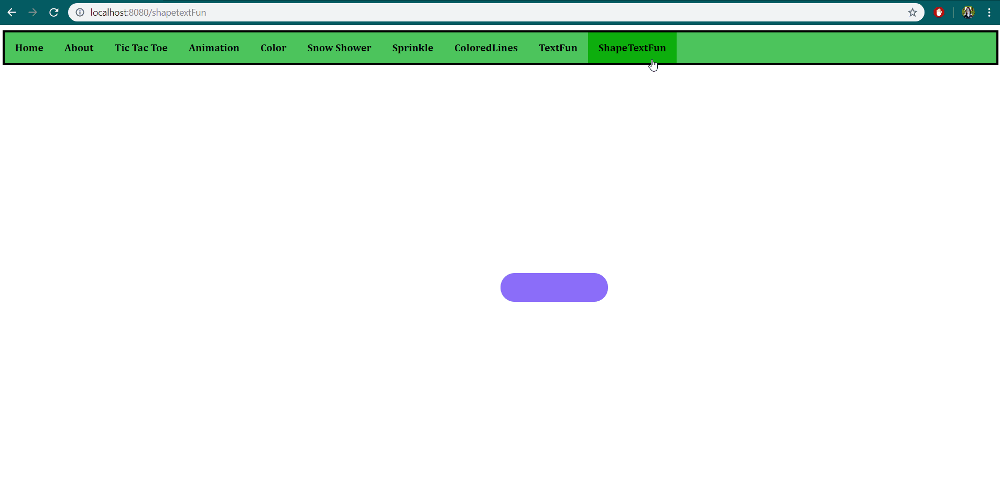

#vue-sprinklecompleted
<p>
  <a href="https://www.npmjs.com/package/vue-sprinklecompleted"></a>
  <a href="https://www.npmjs.com/package/vue-sprinklecompleted"></a>
  <a href="https://www.npmjs.com/package/vue-sprinklecompleted"></a>
</p>

> Creates a spinning completed component for your page!


### Install
#### https://www.npmjs.com/package/vue-sprinklecompleted

### Usage
```js
import VueSprinkleCompleted from 'vue-sprinklecompleted';

export default {
  components: {
	  VueSprinkleCompleted
  },
  ...
}

props: {
			text: {
				type: String,
				default: 'Complete!'
			},
			backgroundColor: {
				type: String,
				default: ' #8b6dfa'
            },
            borderType: {
				type: String,
				default: '2px dashed #8b6dfa'
            },
            textColor: {
				type: String,
                default: 'white'
```


